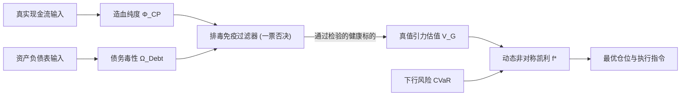

# TRINITY QUANT: 终极真值引力量化系统架构与数学推演白皮书
> **The Trinity Truth-Gravity Quantitative Architecture & Mathematical Specification**  
> **版本**：v1.0.0-CANONICAL  
> **创建时间**：2026-09-13  
> **地位**：系统唯一主干设计规格书，研发实施的最高技术指导蓝图

---

## 目录
1. [系统愿景与三大物理公理](#一-系统愿景与三大物理公理)
2. [严密反伪：四大“伪量化”数学铁证](#二-严密反伪四大伪量化数学铁证)
3. [四大核心数学方程组](#三-四大核心数学方程组)
4. [系统整体架构与四大模块目录规划](#四-系统整体架构与四大模块目录规划)
5. [数据流与生命周期管道（Pipeline）](#五-数据流与生命周期管道pipeline)
6. [分阶段研发实施路线图（Roadmap）](#六-分阶段研发实施路线图roadmap)
7. [新窗口与智能体交接指引](#七-新窗口与智能体交接指引)

---

## 一、 系统愿景与三大物理公理

量化交易长期以来被两股错误思潮所笼罩：一股是沉迷于价格 K 线形态与滞后指标交叉的“技术拟合流”；另一股是堆砌数千个浅层因子、依赖机器学习暴力过拟合历史噪音的“炼金流”。这两者在真实市场的摩擦成本与下行黑天鹅面前均不堪一击。

**TRINITY QUANT** 建立在真实金融物理法则之上，以企业底层**真实现金流造血能力（Truth）**为地基，以**内在价值折现（Gravity）**为引力场，以**几何复利最优化（Convexity）**为防御护城河，打造不可摧毁的工业级量化生命体。

### 核心物理三大公理

```
                   ┌──────────────────────────────┐
                   │   公理一：现金流守恒公理     │
                   │   (真实造血，拒绝应收账款虚假利润) │
                   └──────────────┬───────────────┘
                                  │ 支撑
                                  ▼
                   ┌──────────────────────────────┐
                   │   公理二：几何复利与熵减公理 │
                   │   (波动性拖累最小化，复利几何增长)│
                   └──────────────┬───────────────┘
                                  │ 驱动
                                  ▼
                   ┌──────────────────────────────┐
                   │   公理三：非对称凸性防御公理 │
                   │   (有限下行尾部风险，无限上行敞口)│
                   └──────────────────────────────┘
```

1. **公理一：现金流守恒公理（Cash Flow Conservation）**  
   任何企业资产的内在价值，严格等于其在存续期间所能产生的全部自由现金流（Free Cash Flow）的折现值。会计账面利润（Net Profit）受制于权责发生制，极易被应收账款、存货跌价与资产减值粉饰；唯有实打实流入银行账户的现金流，才是分红、回购、资本开支与偿还债务的唯一物理实体。

2. **公理二：几何复利与熵减公理（Geometric Compounding & Entropy Reduction）**  
   财富的演进受乘法控制而非加法控制。算术平均收益是虚妄的账面游戏，真实财富积累完全取决于对数几何增长率。系统必须主动消灭资金曲线的“负向方差”，因为每一次深幅回撤都将造成巨大的“波动性拖累（Volatility Drag）”，使系统陷入不可逆的数学复利深渊。

3. **公理三：非对称凸性防御公理（Asymmetric Convexity）**  
   拒绝任何“平时小赚、一次性暴毙”的火鸡型策略。投资组合的收益分布必须具备正向偏度（Positive Skewness），即通过排毒防火墙彻底封死下行极端肥尾（Left-Tail Risk / CVaR），在确保绝对生存的前提下捕捉价值均值回归的非对称红利。

---

## 二、 严密反伪：四大“伪量化”数学铁证

### 伪量化一：纯 K 线与技术形态拟合（期望收益破产定理）
* **数学定理**：若价格序列 $P_t$ 在微观上近似局部鞅过程（Local Martingale），且无基本面外生增量信息，则单纯基于历史滞后价格过滤的技术交易系统，其扣费净收益满足：
  $$\mathbb{E}[\Delta W] = \mathbb{E}\left[\sum_{t=1}^{T} \mathbf{1}_{\{signal_t\}} (P_{t+1} - P_t) - C_{friction}\right] < 0$$
* **实证分析**：包含印花税（0.05%~0.1%）、券商双边佣金（万分之二至五）、买卖冲击滑点（0.1%~0.3%）在内，单次往返交易成本高达 $0.3\% \sim 0.5\%$。年化换手率 20 倍的纯短线指标系统，每年仅摩擦成本就吞噬 $6\% \sim 10\%$ 的本金。没有任何技术指标能超越这道摩擦引力墙。

### 伪量化二：算术暴利替代几何复利（波动性拖累陷阱）
* **数学定理**：设策略单期收益率为随机变量 $R$，均值为 $\mu$，方差为 $\sigma^2$。其几何复合年化增长率（CAGR）二阶泰勒展开为：
  $$g = \mathbb{E}[\ln(1 + R)] \approx \mu - \frac{1}{2}\sigma^2$$
  其中 $\frac{1}{2}\sigma^2$ 即为无情的**波动性拖累（Volatility Drag）**！
* **铁证计算**：
  $$1 \times (1 + 50\%) \times (1 - 50\%) = 1.5 \times 0.5 = 0.75 \quad (\text{算术平均 } 0\%, \text{ 实际亏损 } -25\%)$$
  亏损 $50\%$ 需上涨 $100\%$ 回本；亏损 $80\%$ 需暴涨 $400\%$ 回本。忽略尾部回撤控制、盲目追求高波动的策略，是数学上的自杀。

### 伪量化三：市盈率（P/E）假象 vs 现金流与债务到期墙
* **历史血证**：安然（Enron）、乐视网、康美药业、暴雷房企在暴雷前夕，其动态市盈率常表现为“极度便宜（个位数 P/E）”，引发伪量化系统疯狂“抄底”。
* **机制真相**：虚假繁荣的净利润挂在“应收账款（假钱）”上，而短期有息负债在 1 年内必须用真实现金偿付。当债务到期墙来临，现金流断裂导致流动性休克，股票直接崩盘走向退市。

### 伪量化四：样本内过拟合与先知函数（P-Hacking & Lookahead）
* 采用未经 Point-in-Time 检验的财务数据（如在 4 月 10 日提前使用 4 月 30 日才披露的年报）；
* 采用剔除退市股票后的幸存样本池，人为制造“完美净值曲线”；
* 调整几十个超参数以迎合过去的某一段牛市，实盘上线立即坍塌。

---

## 三、 四大核心数学方程组



### 1. 造血纯度方程 $\Phi_{CP}$ (Cash Purity Index)
用于穿透权责发生制利润，测算每一分利润背后的真金白银含量：

$$\Phi_{CP} = \left( \frac{\text{OCF} - \Delta\text{WC}}{\max(1, |\text{NetProfit}|) + \text{DeprAmort}} \right) \times \left( 1 - \frac{\min(\text{Revenue}, \text{Receivables})}{\max(1, \text{Revenue})} \right)$$

* $\text{OCF}$：经营活动现金流量净额（Operating Cash Flow）
* $\Delta\text{WC}$：非现金营运资本变动（Working Capital Change）
* $\text{Receivables}$：应收账款及应收票据
* $\text{Revenue}$：营业收入
* **物理意义**：当 $\Phi_{CP} < 0.3$ 时，表明企业利润大部分为账面欠条，直接亮黄牌；$\Phi_{CP} < 0$ 时亮红牌一票否决。

### 2. 债务毒性指数 $\Omega_{Debt}$ (Debt Toxicity & Maturity Wall Index)
用于监控企业在未来 12 个月内是否会遭遇“债务到期墙”流动性猝死：

$$\Omega_{Debt} = \frac{\text{ST\_Debt} + \text{Current\_LT\_Debt} + \text{Commercial\_Paper}}{\text{Cash\_Equiv} + \max(0, \text{FCF}_{ttm})} \times \left( 1 + \frac{\text{Fin\_Expense}}{\max(1, \text{EBITDA})} \right)$$

* $\text{ST\_Debt}$：短期借款
* $\text{Current\_LT\_Debt}$：一年内到期的非流动负债
* $\text{Cash\_Equiv}$：受限资金扣减后的真实货币资金
* $\text{FCF}_{ttm}$：过去12个月自由现金流（$\text{OCF} - \text{CapEx}$）
* **安全阈值**：
  * $\Omega_{Debt} \le 0.8$：绝对安全区（资金充沛，免疫偿债危机）
  * $0.8 < \Omega_{Debt} \le 1.2$：预警观察区
  * $\Omega_{Debt} > 1.2$：极度危险区，排毒防火墙**无条件一票否决淘汰**！

### 3. 真值引力估值方程 $V_G$ (Gravity Valuation Formula)
资产价格围绕其真实价值核心呈弹性摆动。引力估值模型融合了现金流折现（DCF）造血价值与硬资产重置清算价值：

$$V_G = \sum_{t=1}^{N} \frac{\text{FCFE}_t \times \min(1.0, \Phi_{CP, t})}{(1 + r_e)^t} + \frac{\text{NAV}_{tangible} \times (1 - \delta_{impair})}{(1 + r_e)^N}$$

* $\text{FCFE}_t$：未来第 $t$ 期股权自由现金流
* $r_e$：股权资本成本（基于无风险利率 + 真实股权风险溢价 ERP）
* $\text{NAV}_{tangible}$：有形净资产（剔除商誉、无形资产与虚高存货）
* $\delta_{impair}$：资产减值预期折价系数
* **引力势能比率（Gravity Potential）**：
  $$G_{potential} = \frac{V_G - P_t}{P_t}$$
  当 $G_{potential} > 0.3$ 且免疫系统亮绿灯时，标的处于极具安全边际的引力洼地。

### 4. 动态非对称凯利方程 $f^*$ (Convex Dynamic Kelly)
将经典凯利公式（Kelly Criterion）升级为抗尾部风险、引力折价调制的实盘仓位分配方程：

$$f^* = \max\left(0, \;\; \frac{p \cdot b - (1 - p)}{b} \times \frac{1}{1 + \gamma \cdot \text{CVaR}_{\alpha}} \times \min\left(1.0, \;\; \max\left(0, \frac{V_G - P_t}{P_t}\right)\right)\right)$$

* $p$：基于引力势能与动量共振计算的胜率
* $b$：上行目标与止损距离的比值（盈亏比）
* $\text{CVaR}_{\alpha}$：置信度 $\alpha$（如 99%）下的条件在险价值（尾部预期损失）
* $\gamma$：尾部风险惩罚弹性系数（通常 $\gamma \ge 2.0$）
* **特性**：当下行肥尾风险剧增（$\text{CVaR}$ 飙升）或当前价格高于真值（$P_t \ge V_G$）时，仓位自动归零（$f^* \to 0$），彻底免疫黑天鹅。

---

## 四、 系统整体架构与四大模块目录规划

整个系统布局在工程根目录下，各模块分工明确，零循环依赖：

```
/Volumes/tianyou-168/顶级量化/
├── AGENTS.md                   # 最高工程与量化开发宪法
├── TRINITY_QUANT_SPEC.md       # 系统终极架构白皮书（本文档）
├── configs/                    # 全局参数、阈值与环境配置
│   ├── system_config.yaml      # 系统级参数配置
│   └── risk_limits.yaml        # 严格风险与仓位硬限制
├── truth_kernel/               # 【核心1：真值内核】
│   ├── __init__.py
│   ├── pit_loader.py           # Point-in-Time 无偏财务与行情载入器
│   ├── cash_flow_engine.py     # 真实造血现金流计算引擎
│   ├── debt_structure.py       # 债务期限结构拆解分析器
│   └── pit_calendar.py         # 披露日对齐与时空防穿透控制器
├── immune_system/              # 【核心2：免疫排毒系统】
│   ├── __init__.py
│   ├── cash_purity.py          # 造血纯度 Φ_CP 计算与造假预警
│   ├── debt_wall.py            # 债务毒性 Ω_Debt 与偿债风险熔断
│   ├── goodwill_trap.py        # 商誉与高估存货排毒筛查
│   └── poison_firewall.py      # 一票否决排毒流水线 (Toxic Screener)
├── gravity_brain/              # 【核心3：引力大脑】
│   ├── __init__.py
│   ├── dcf_gravity.py          # 现金流折现与有形资产真值求解器
│   ├── margin_of_safety.py     # 安全边际与引力势能测算
│   ├── convex_alpha.py         # 非对称凸性 Alpha 生成与信号融合
│   └── regime_detector.py      # 宏观与流动性环境状态识别机
├── entropy_execution/          # 【核心4：熵减执行与风控】
│   ├── __init__.py
│   ├── dynamic_kelly.py        # 动态防爆凯利仓位分配器
│   ├── friction_engine.py      # 纳秒/日频高精度滑点与摩擦税费模型
│   ├── portfolio_guardian.py   # 组合级下行 CVaR 监控与熔断守护者
│   └── paper_broker.py         # 仿真撮合与订单执行接口
└── tests/                      # 【工业级高标准自动化测试】
    ├── test_pit_calendar.py    # 严查有无未来函数穿透
    ├── test_immune_system.py   # 严测安然/乐视等暴雷样本识别率 (须 100%)
    ├── test_gravity_brain.py   # 真值估值边界测试
    └── test_dynamic_kelly.py   # 极端暴跌行情抗压测试
```

---

## 五、 数据流与生命周期管道（Pipeline）

```
[原始行情与财务数据源] (Wind / AkShare / Tushare / 自建DB)
        │
        ▼
┌────────────────────────────────────────────────────────┐
│ 1. Point-in-Time 物理时间锁 (truth_kernel/pit_calendar)│
│    - 严格按实际披露时间戳对齐，抹杀一切先知未来函数     │
└───────────────────────┬────────────────────────────────┘
                        │
                        ▼
┌────────────────────────────────────────────────────────┐
│ 2. 免疫系统一票否决筛查 (immune_system/poison_firewall) │
│    - 检验 Φ_CP < 0.3？ -> 淘汰                         │
│    - 检验 Ω_Debt > 1.2？ -> 淘汰                       │
│    - 检验 商誉比率 > 30%？ -> 淘汰                     │
│    => 输出：具备强造血能力、零猝死风险的【纯净真值池】  │
└───────────────────────┬────────────────────────────────┘
                        │
                        ▼
┌────────────────────────────────────────────────────────┐
│ 3. 引力估值与势能计算 (gravity_brain/dcf_gravity)       │
│    - 计算每股真值 V_G                                   │
│    - 计算安全边际与势能差 G_potential                  │
│    - 融合流动性与波动率状态识别                         │
│    => 输出：确定性收益期望分布与非对称 Alpha 信号       │
└───────────────────────┬────────────────────────────────┘
                        │
                        ▼
┌────────────────────────────────────────────────────────┐
│ 4. 熵减执行与风控 (entropy_execution/dynamic_kelly)    │
│    - 计算 CVaR 下行惩罚                                │
│    - 动态凯利求解单标的及全组合最优配置权重 f*         │
│    - 严格计提滑点、印花税、冲击成本撮合成交             │
│    => 输出：最小化方差拖累、稳健几何复利的财富曲线     │
└────────────────────────────────────────────────────────┘
```

---

## 六、 分阶段研发实施路线图（Roadmap）

### Phase 1: 基础设施与免疫排毒模块 (Week 1)
* **交付物**：
  1. `configs/` 结构化参数体系；
  2. `truth_kernel/pit_calendar.py`：建立时空隔离测试框架，确保单测自动拦截任何未来函数；
  3. `immune_system/` 全套落地（包含 $\Phi_{CP}$ 与 $\Omega_{Debt}$ 计算引擎）；
  4. 引入历史知名暴雷股（如乐视网、康美药业退市前财报）进行实证单测，验证排毒拦截率达到 **100%**。

### Phase 2: 真值内核与现金流特征工程 (Week 2)
* **交付物**：
  1. `truth_kernel/cash_flow_engine.py`：清洗扣非净现金流、资本开支真实折旧；
  2. 完整的资产负债表与现金流量表特征矩阵生成流水线；
  3. 单元测试覆盖率严格达到 $90\%$ 以上。

### Phase 3: 真值引力大脑与定价模型 (Week 3)
* **交付物**：
  1. `gravity_brain/dcf_gravity.py`：动态 WACC 与两阶段自由现金流引力估值器；
  2. 宏观流动性环境状态机，输出市场所处周期状态；
  3. 形成多维真值安全边际排序体系。

### Phase 4: 熵减执行、动态凯利与全真实摩擦回测 (Week 4)
* **交付物**：
  1. `entropy_execution/dynamic_kelly.py`：CVaR 约束动态凯利分配；
  2. 计提印花税、滑点冲击的高保真事件驱动撮合器；
  3. 全市场真实历史大周期（2015 股灾、2018 单边熊市、2020 流动性危机）抗压回测验证。

---

## 七、 新窗口与智能体交接指引

为保证新开窗口中的 AI 工程师完全承接本白皮书的所有顶层设计与工程宪法，启动时请执行以下三步：

1. **工作区指向**：确保新窗口打开的根目录为 `/Volumes/tianyou-168/顶级量化`。
2. **宪法与白皮书就绪**：新窗口启动时将自动识别工作区根目录下的：
   - `AGENTS.md`（最高开发宪法）
   - `TRINITY_QUANT_SPEC.md`（本白皮书）
3. **第一句激活唤醒咒语（直接复制发送给新 AI）**：

```markdown
请严格阅读工作区根目录下的 AGENTS.md（最高宪法）与 TRINITY_QUANT_SPEC.md（终极真值引力量化系统白皮书）。
你已完全掌握这套避开一切伪量化陷阱、基于第一性原理的系统架构。
现在，请严格遵守最高宪法，开始执行【Phase 1: 基础设施与免疫排毒模块】的开发！
```

---
*文档铸造完成。真理与代码同在。*
